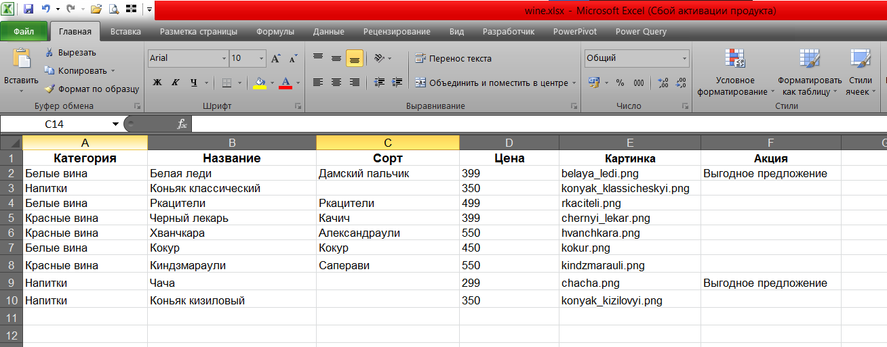
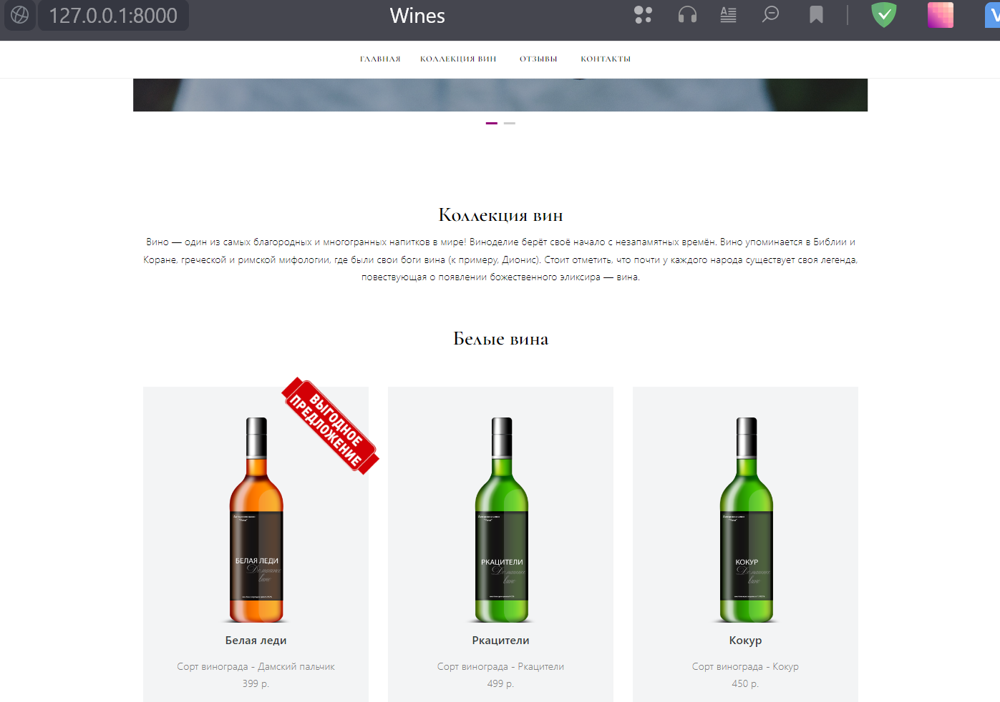

# Новое русское вино

Сайт магазина авторского вина "Новое русское вино".
Скрипт позволяет изменять категории, ассортимент и атрибуты товаров на сайте.

### Как установить
Python3 должен быть установлен. Далее загрузите ряд зависимостей с помощью pip (pip3):

    pip install -r requirements.txt

### Запуск

- Скачайте код
- Запустите сайт командой `python3 main.py`
- Перейдите на сайт по адресу [http://127.0.0.1:8000](http://127.0.0.1:8000).

### Управление ассортиментом

Для изменения данных по товарам, необходимо внести изменения в файл `wine.xlxs`.
Файл выглядит следующим образом:

Нельзя изменять шапку таблицы. Редактировать можно только содержимое строк.
После внесения изменений в файл, нужно перезапустить скрипт.

### Пример успешного запуска

## Цели проекта

Код написан в учебных целях — это урок в курсе по Python и веб-разработке на сайте [Devman](https://dvmn.org).
